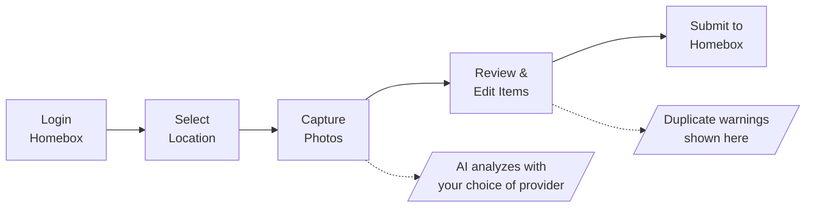

<h1 align="center" style="margin-top: -10px;"></h1>

<div align="center">
  <a href="#"></a>
</div>

<h1 align="center" style="margin-top: -10px;"> Homebox Companion (Enhanced Fork) </h1>

> **Fork of [Duelion/homebox-companion](https://github.com/Duelion/homebox-companion)** with privacy-first enhancements.
> Not affiliated with the Homebox project. This is an unofficial third-party companion app.

AI-powered companion for [Homebox](https://github.com/sysadminsmedia/homebox) inventory management.

<table align="center">
  <tr>
    <td></td>
    <td></td>
    <td></td>
    <td></td>
  </tr>
</table>

Take a photo of your stuff, and let AI identify and catalog items directly into your Homebox instance. Perfect for quickly inventorying a room, shelf, or collection.

## Fork Enhancements

This fork adds the following features while maintaining full compatibility with the upstream project:

| Feature | Description |
|---------|-------------|
| **Multi-Provider AI** | Switch between OpenAI, Anthropic, and Ollama from the Settings UI |
| **Local AI (Ollama)** | Privacy-first local processing - images never leave your network |
| **Product Enrichment** | AI-powered spec lookup fills in product details from web search |
| **Duplicate Detection** | Multi-strategy matching (serial, manufacturer+model, fuzzy name) |
| **Update Existing Items** | Merge new photos/data into existing items when duplicates found |
| **Provider Fallback** | Auto-retry with backup provider if primary fails |
| **Token Usage Display** | Optional display of AI token consumption |
| **Custom API Endpoints** | OpenAI-compatible endpoints (Azure, LiteLLM proxy, etc.) |
| **In-App Configuration** | Configure everything in the UI - no YAML/env vars required |

See the [Wiki](../../wiki) for detailed documentation on all features.

---

## Quick Start (This Fork)

### Simplified Docker Deployment

```yaml
# docker-compose.yml
services:
  homebox-companion:
    image: ghcr.io/synssins/homebox-companion:latest
    container_name: homebox-companion
    restart: always
    ports:
      - 8000:8000
    volumes:
      - ./homebox-companion:/data  # All persistent data (settings, sessions, indexes)

```

```bash
docker compose up -d
```

Open `http://localhost:8000` and configure everything in the Settings page:
1. **Connection Settings** - Enter your Homebox URL
2. **AI Provider** - Configure OpenAI, Anthropic, or Ollama
3. **Behavior Settings** - Enable duplicate detection

> **No environment variables required!** All configuration is done in the browser and persists in the data volume.

### Using Local AI (Ollama)

For complete privacy with no cloud dependencies:

```yaml
services:
  homebox-companion:
    image: ghcr.io/synssins/homebox-companion:latest
    ports:
      - 8000:8000
    volumes:
      - ./homebox-companion:/app/data  # All persistent data

  ollama:
    image: ollama/ollama:latest
    ports:
      - 11434:11434
    volumes:
      - ollama-models:/root/.ollama

volumes:
  ollama-models:
```

Then in Settings > AI Provider:
1. Enable Ollama
2. Set URL to `http://ollama:11434`
3. Select a vision model (e.g., `minicpm-v`)

Pull the model first: `docker exec ollama ollama pull minicpm-v`

---

## How It Works



1. **Login** - Authenticate with your existing Homebox credentials
2. **Select Location** - Browse the location tree, search, or scan a Homebox QR code
3. **Capture Photos** - Take or upload photos of items (supports multiple photos per item)
4. **AI Detection** - AI vision identifies items, quantities, and metadata
5. **Review & Edit** - Adjust AI suggestions, see duplicate warnings
6. **Submit** - Items are created in your Homebox inventory with photos attached

---

## Fork-Specific Features

### Multi-Provider AI Configuration

Configure and switch between AI providers directly in the Settings UI:

- **OpenAI** - GPT-4o, GPT-4o-mini (cloud, paid)
- **Anthropic** - Claude models (cloud, paid)
- **Ollama** - Local models like minicpm-v, llava (free, private)

Each provider can be enabled/disabled independently. The active provider is shown with a ⭐ badge on the Settings page.

**Custom API Endpoints**: OpenAI supports custom `api_base` URLs for:
- Azure OpenAI deployments
- LiteLLM proxy servers
- Any OpenAI-compatible API

**Provider Fallback**: Enable automatic retry with a backup provider if the primary fails.

**Configurable Timeout**: Ollama users can adjust the timeout (30-600s) for slow vision models on CPU.

### Product Enrichment

AI-powered specification lookup to automatically fill in product details:

- Searches the web for product specifications using the manufacturer and model number
- Fills in description, features, MSRP, release year, and category
- Uses configured search provider (Tavily, Google Custom Search, or SearXNG)
- Caches results to avoid repeated lookups
- Privacy-first: Serial numbers are never sent externally

Enable in Settings > Enrichment. Configure your preferred search provider API.

### Duplicate Detection

Multi-strategy detection prevents accidentally creating duplicate entries:

| Strategy | Description |
|----------|-------------|
| **Serial Number** | Exact match on serial numbers |
| **Manufacturer + Model** | Matches same manufacturer AND model number |
| **Fuzzy Name** | Similar product names (configurable threshold) |

When duplicates are found during review:
- Warning banner shows matched item with confidence score
- **Update Existing**: Merge new photos and fill empty fields into the existing item
- **Create New**: Override and create a new item anyway
- Match field is protected (won't overwrite the field that caused the match)

Enable in Settings > Behavior Settings.

### Token Usage Display

Optional display showing AI token consumption for each analysis:
- Input tokens (image + prompt)
- Output tokens (AI response)
- Helps monitor API costs

Enable in Settings > Behavior Settings > Show Token Usage.

### In-App Settings

All configuration moved from environment variables to the UI:

| Setting | Location |
|---------|----------|
| Homebox URL | Settings > Connection |
| Image Quality | Settings > Connection |
| AI Provider/Keys | Settings > AI Provider |
| Ollama Timeout | Settings > AI Provider > Ollama |
| Provider Fallback | Settings > AI Provider |
| Duplicate Detection | Settings > Behavior |
| Token Usage Display | Settings > Behavior |
| Enrichment | Settings > Enrichment |
| Search Provider | Settings > Enrichment |

Settings persist in `/app/data` - mount the volume and configure once.

---

## Original Features

All features from the upstream project are preserved:

### AI-Powered Detection
- Identifies multiple items in a single photo
- Extracts manufacturer, model, serial number, price when visible
- Suggests labels from your existing Homebox labels
- Multi-language support

### Smart Workflow
- **Multi-image analysis** - Take photos from multiple angles for better accuracy
- **Single-item mode** - Force AI to treat a photo as one item (for sets/kits)
- **AI corrections** - Tell the AI what it got wrong and it re-analyzes
- **Custom thumbnails** - Crop and select the best image for each item

### Location Management
- Browse hierarchical location tree
- Search locations by name
- Scan Homebox QR codes
- Create new locations on the fly

### Chat Assistant
- **Natural language queries** - Ask questions like "How many items do I have?"
- **Inventory actions** - Create, update, move, or delete items through conversation
- **Approval workflow** - Review AI-proposed changes before they're applied

<details>
<summary>Available Chat Tools</summary>

The chat assistant has access to 21 tools for interacting with your Homebox inventory:

**Read-Only** (auto-execute):
| Tool | Description |
|------|-------------|
| `list_locations` | List all locations |
| `get_location` | Get location details with children |
| `list_labels` | List all labels |
| `list_items` | List items with filtering/pagination |
| `search_items` | Search items by text query |
| `get_item` | Get full item details |
| `get_item_by_asset_id` | Look up item by asset ID |
| `get_item_path` | Get item's full location path |
| `get_location_tree` | Get hierarchical location tree |
| `get_statistics` | Get inventory statistics |
| `get_statistics_by_location` | Item counts by location |
| `get_statistics_by_label` | Item counts by label |
| `get_attachment` | Get attachment content |

**Write** (requires approval):
| Tool | Description |
|------|-------------|
| `create_item` | Create a new item |
| `update_item` | Update item fields |
| `create_location` | Create a new location |
| `update_location` | Update location details |
| `create_label` | Create a new label |
| `update_label` | Update label details |
| `upload_attachment` | Upload attachment to item |
| `ensure_asset_ids` | Assign asset IDs to all items |

**Destructive** (requires approval):
| Tool | Description |
|------|-------------|
| `delete_item` | Delete an item |
| `delete_location` | Delete a location |
| `delete_label` | Delete a label |

</details>

---

## Configuration

### Environment Variables (Optional)

While this fork allows full configuration via the UI, environment variables still work for automated deployments:

<details>
<summary>Essential Settings</summary>

| Variable | Required | Description |
|----------|----------|-------------|
| `HBC_LLM_API_KEY` | No* | Your OpenAI API key (*can configure in UI) |
| `HBC_HOMEBOX_URL` | No* | Your Homebox instance URL (*can configure in UI) |

</details>

<details>
<summary>Full Configuration Reference</summary>

**Core Settings**
| Variable | Default | Description |
|----------|---------|-------------|
| `HBC_HOMEBOX_URL` | - | Your Homebox instance URL |
| `HBC_IMAGE_QUALITY` | `medium` | Image quality: `raw`, `high`, `medium`, `low` |
| `HBC_DATA_DIR` | `./data` | Data directory (becomes `/app/data` in Docker) |
| `HBC_SERVER_HOST` | `0.0.0.0` | Server bind address |
| `HBC_SERVER_PORT` | `8000` | Server port |
| `HBC_LOG_LEVEL` | `INFO` | Logging level |

**AI Provider Settings**
| Variable | Default | Description |
|----------|---------|-------------|
| `HBC_LLM_API_KEY` | - | OpenAI/Anthropic API key |
| `HBC_LLM_MODEL` | `gpt-4o-mini` | Model to use for cloud AI |
| `HBC_LLM_API_BASE` | - | Custom API base URL (Azure, LiteLLM, etc.) |
| `HBC_LLM_TIMEOUT` | `120` | LLM request timeout in seconds |
| `HBC_OLLAMA_URL` | `http://localhost:11434` | Ollama server URL |
| `HBC_OLLAMA_MODEL` | `minicpm-v` | Ollama model for vision |
| `HBC_OLLAMA_TIMEOUT` | `120` | Ollama request timeout in seconds |

**Feature Flags**
| Variable | Default | Description |
|----------|---------|-------------|
| `HBC_CHAT_ENABLED` | `false` | Enable chat assistant feature |
| `HBC_DUPLICATE_DETECTION` | `true` | Enable duplicate item detection |
| `HBC_SHOW_TOKEN_USAGE` | `false` | Show AI token usage in UI |

**Enrichment Settings**
| Variable | Default | Description |
|----------|---------|-------------|
| `HBC_ENRICHMENT_ENABLED` | `false` | Enable product enrichment |
| `HBC_ENRICHMENT_AUTO` | `false` | Auto-enrich on scan |
| `HBC_SEARCH_PROVIDER` | `none` | Search provider: `tavily`, `google`, `searxng`, `none` |
| `HBC_SEARCH_TAVILY_API_KEY` | - | Tavily API key |
| `HBC_SEARCH_GOOGLE_API_KEY` | - | Google Custom Search API key |
| `HBC_SEARCH_GOOGLE_ENGINE_ID` | - | Google Custom Search Engine ID |
| `HBC_SEARCH_SEARXNG_URL` | - | SearXNG instance URL |

</details>

---

## Tips

- **Use local AI for privacy** - Ollama keeps all image processing on your network
- **Enable duplicate detection** - Prevents accidentally re-adding items you already have
- **Use "Update Existing"** - When a duplicate is found, merge new photos into the existing item
- **Enable enrichment** - Let AI fill in product specs automatically from web search
- **Increase Ollama timeout** - Vision models on CPU can be slow; try 300-600s
- **Set up provider fallback** - Use Ollama as primary, cloud as backup for reliability
- **Batch more items** - Images are analyzed in parallel, so more items = faster per-item
- **Include receipts** - AI can extract purchase price, retailer, and date
- **Multiple angles** - Include close-ups of labels, serial numbers for accuracy
- **Long press to confirm all** - On review screen, long-press confirm to accept all items

---

## Compatibility

- **Upstream compatible** - All original features work unchanged
- **Homebox v0.21+** - Tested with recent Homebox versions
- **Environment variables** - All original env vars still work
- **API compatible** - No breaking changes to API endpoints

---

## License

This project is licensed under the GNU General Public License v3.0 - see the [LICENSE](LICENSE) file for details.

## Acknowledgments

- **[Duelion/homebox-companion](https://github.com/Duelion/homebox-companion)** - Original project this fork is based on
- [Homebox](https://github.com/sysadminsmedia/homebox) - The inventory system this app extends
- [OpenAI](https://openai.com) - Vision AI capabilities (GPT models)
- [Ollama](https://ollama.ai) - Local AI runtime
- [LiteLLM](https://docs.litellm.ai/) - LLM provider abstraction layer
- [FastAPI](https://fastapi.tiangolo.com) & [SvelteKit](https://kit.svelte.dev) - Backend & frontend frameworks

---

<p align="center">
  <i>Original project by <a href="https://github.com/Duelion">Duelion</a> -
  <a href="https://buymeacoffee.com/duelion" target="_blank">Buy them a coffee</a></i>
</p>
